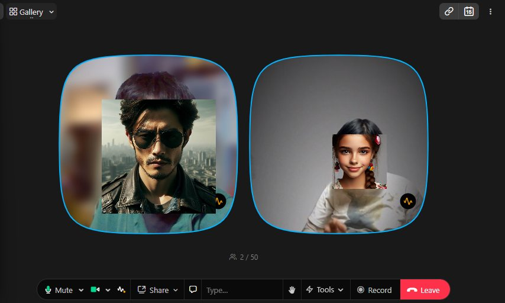

# Avatarian
Avatarian is an app that transforms the faces of people in web conferences into avatars in real-time.

### Demo image
   
This is a demo image Avatarian on "Around" web meeting.

### How to Use
Please execute the following command:
```shell
python main.py "Window name of your app"
```
Currently, only the window that is in the foreground can be captured.

### Avatars
At this moment you can use only images.  
Please save your favorite avatar image in the avatars folder in either jpg or png format.

### How to install
You can install this app in 5 steps for Windows.
1. Install C++ compiler  
2. Install Cmake  
3. Install Python  
4. Download Avatarian as zip file and extract it.  
5. Install libraries of Python.
```shell
pip install opencv-python face_recognition pyautogui pygetwindow setuptools
```


A lot of user may use this app for work.  
Then you need to care about licence of C++ compiler.  
I recommend [Microsoft C++ Build Tool](https://visualstudio.microsoft.com/ja/visual-cpp-build-tools/) for it.  
See the article below for licence.  
[Updates to Visual Studio Build Tools license for C and C++ Open-Source projects](https://devblogs.microsoft.com/cppblog/updates-to-visual-studio-build-tools-license-for-c-and-cpp-open-source-projects/)(August 18th, 2022)  

C++ compiler and Cmake can be installed with Microsoft C++ Build Tool by default.

